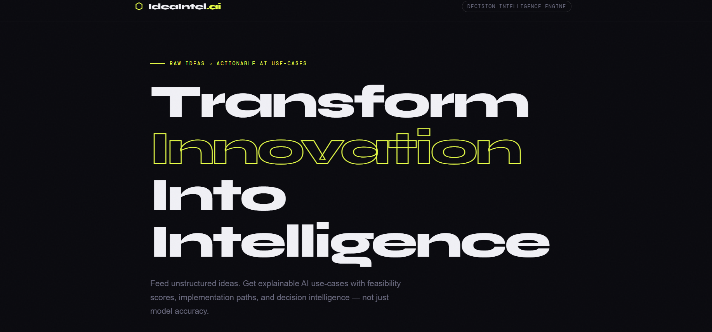
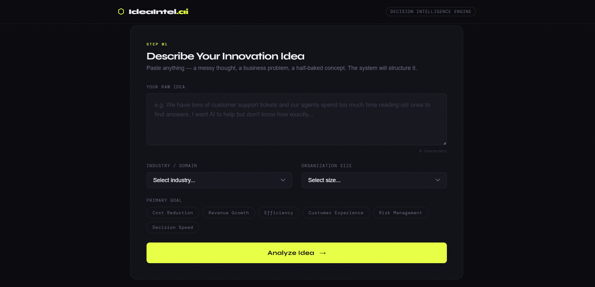
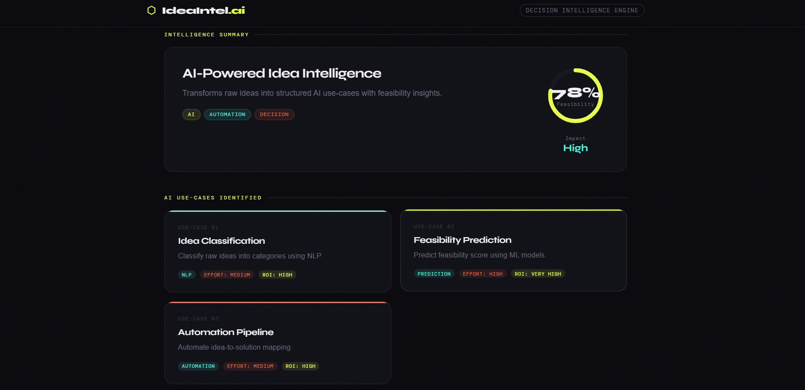

# 🚀 AI Idea Intelligence System

**Transform raw business ideas into structured AI use-cases, feasibility insights, and intelligent decisions.**

> From messy ideas to intelligent AI decisions — in seconds.



---

## 🌟 Overview

The **AI Idea Intelligence System** is a concept-level AI innovation engine designed to convert unstructured, raw business ideas into well-structured, actionable AI-powered solutions. 

Instead of just generating ideas, it simulates how real organizations evaluate AI opportunities — by deeply understanding the business problem, mapping it to the right AI capabilities, assessing feasibility, estimating impact & ROI, identifying risks, and delivering a clear implementation roadmap with decision intelligence.

---

## ✨ Key Features

- 🧠 Converts raw ideas into structured AI use-cases  
- 📊 Generates a Feasibility Score (0–100%) with detailed justification  
- ⚡ Provides Impact and ROI estimation  
- 🧭 Delivers Decision Intelligence — Build vs Buy, Tech recommendations, and Data Readiness  
- 🗺️ Creates a step-by-step implementation roadmap  
- ⚠️ Identifies risks (technical, ethical, operational) and suggests mitigation strategies  
- 🎯 Recommends clear next actions  





---

## 🛤️ How It Works

1. **Input** — User enters a raw business idea or problem  
2. **Analysis** — The system analyzes the idea, context, and objectives  
3. **AI Mapping** — Maps the problem to the most suitable AI techniques and use cases  
4. **Intelligence Generation** — Evaluates feasibility, impact, risks, and ROI  
5. **Roadmap Creation** — Generates a phased implementation plan  
6. **Dashboard Output** — Presents everything in a clean, interactive intelligence dashboard  

---

## 🛠️ Tech Stack

- **Frontend**: HTML5, CSS3, JavaScript  
- **UI Design**: Modern dark theme with glassmorphism and smooth animations  
- **Logic Layer**: Simulated AI response engine (easily replaceable with real AI APIs)

---

## 📂 Project Structure

```bash
ai-idea-intelligence/
├── assets/                  # Screenshots used in README
├── index.html               # Main UI
├── styles.css               # Styling and animations
├── app.js                   # Core logic and AI simulation
└── README.md                # Documentation
```

---

## ▶️ How to Run

Simply open `index.html` in your browser for instant access.

For the best experience, run it using a local server:

```bash
python -m http.server 5500
```

Then visit: **http://localhost:5500**

---

## 🔮 Future Improvements

- Integration with real AI APIs (OpenAI, Anthropic, Grok, etc.)
- Backend development using Flask or Node.js
- Database support for saving and managing ideas
- PDF report export
- User accounts and collaboration features
- Full deployment as a scalable web app

---

## 💡 Perfect For

Innovation teams, AI consultants, Product Managers, Startup founders, and anyone looking to validate and structure AI-driven business ideas efficiently.

---

## 👩‍💻 Author

**Subhalaxmi Panda**  
AI & Data Science Enthusiast 🚀

---

## ⭐ Support

If you liked this project, feel free to give it a ⭐ star and share it with others!

---

**"From messy ideas to intelligent AI decisions."**

---

Made with ❤️ for the future of AI innovation.
